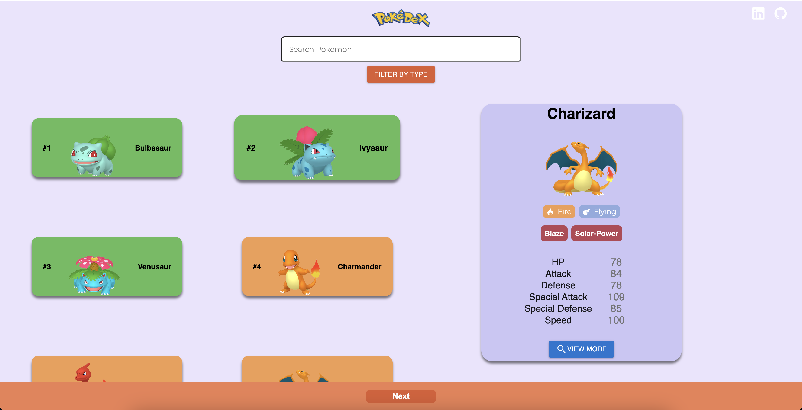
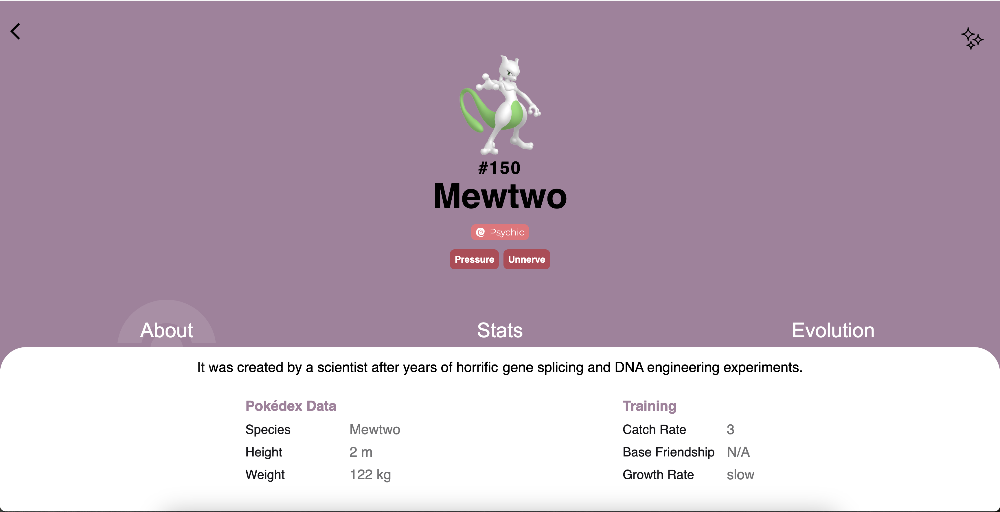

# Pokédex - ReactJS

## 📷 Screenshot

  

  

## 📝 Project Description

The Pokédex project allows users to view the list of Pokémon, search, filter and view the details of the specified Pokemon from the PokéAPI.

## 📚 Technologies

- [ReactJS](https://reactjs.org/)
- [MUI](https://mui.com/)
- [React Router](https://reactrouter.com/)
- [Axios](https://github.com/axios/axios)
- [API: PokéAPI](https://pokeapi.co/)
